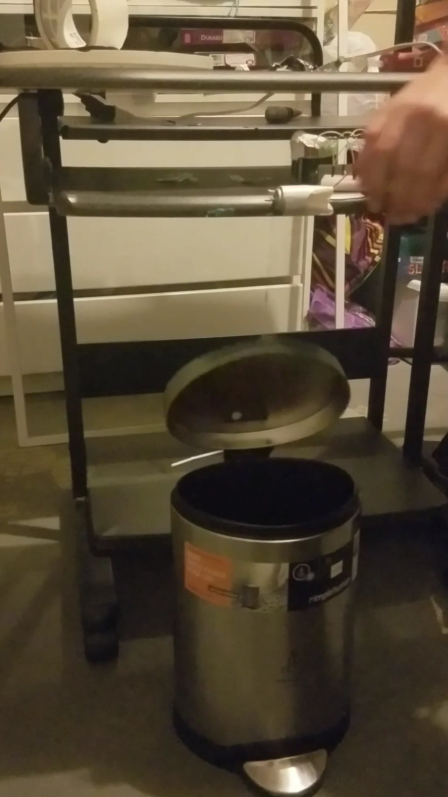
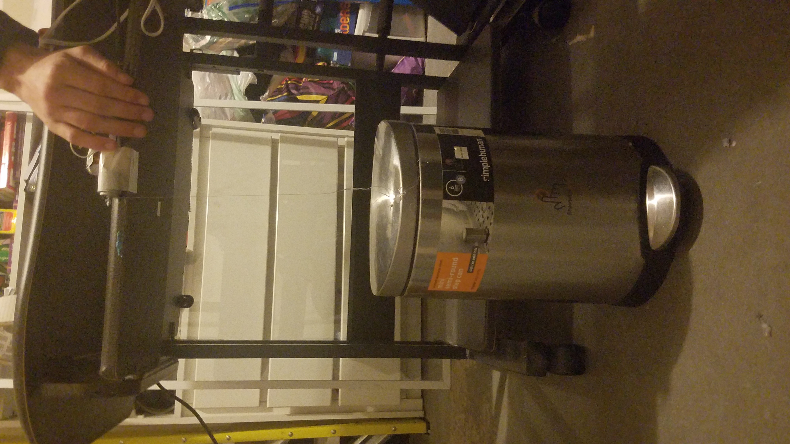

# Ultrasonic-Sensor-Trash-Can
This was a personal project where I made a trash can that would open when a hand was waved in front of it. It used an ultrasonic sensor to detect the hand and a motor to open and close the can.

Closed(Hand not in front of sensor)

Open(Hand in front of sensor)

